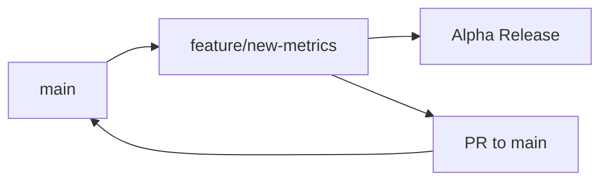
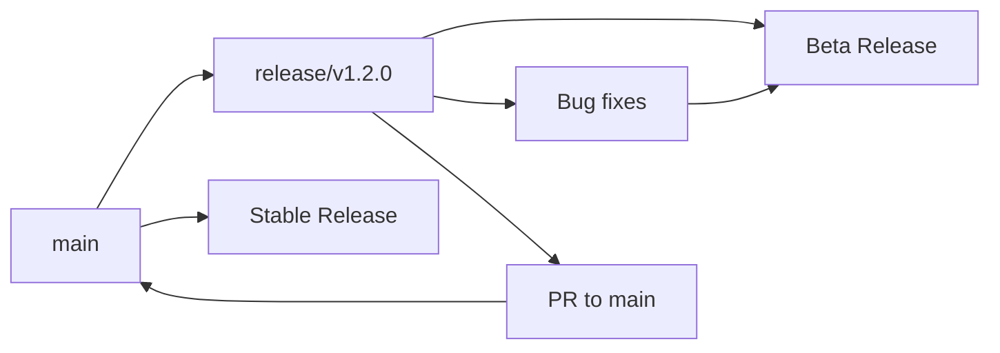
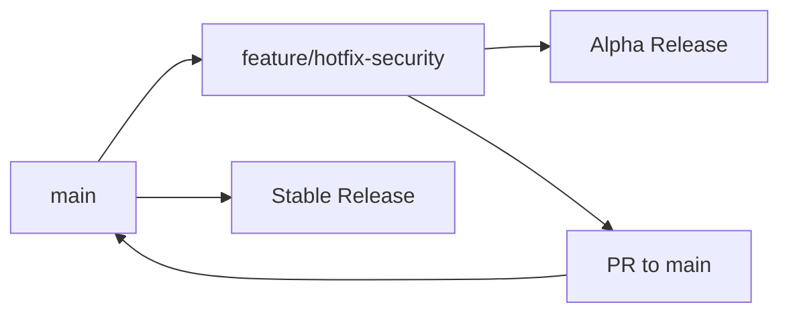

# Branching and Release Strategy

This document outlines the branching model and release strategy for the `@xoon/fastify-prometheus-metrics` project. We follow a **trunk-based development** approach with automated semantic versioning.

## Overview

This project uses a simplified trunk-based development model with automated releases based on semantic commit messages. All development work flows through the `main` branch, with short-lived feature branches and release branches for stabilization.

## Branch Types and Release Mapping

| Branch Type | Purpose | Release Type | Example Version | Auto-Published |
|-------------|---------|--------------|-----------------|----------------|
| `main` | Stable production code | **Stable** | `1.0.0`, `1.1.0`, `2.0.0` | ✅ |
| `release/*` | Release preparation & stabilization | **Beta** | `1.0.0-beta.1`, `1.0.0-beta.2` | ✅ |
| `feature/*` | Feature development & testing | **Alpha** | `1.0.0-alpha.1`, `0.1.0-alpha.3` | ✅ |

## Workflow

### 1. Feature Development



**Steps:**
1. Create feature branch from `main`: `git checkout -b feature/new-metrics`
2. Develop and commit using [conventional commits](#commit-message-format)
3. Push to trigger alpha release (e.g., `1.0.0-alpha.1`)
4. Test the alpha release
5. Create PR to merge back to `main`
6. After review and approval, merge to `main`

### 2. Release Preparation



**Steps:**
1. Create release branch from `main`: `git checkout -b release/v1.2.0`
2. Push to trigger initial beta release (e.g., `1.2.0-beta.1`)
3. Perform testing, bug fixes, and documentation updates
4. Each push creates new beta versions (e.g., `1.2.0-beta.2`)
5. When ready, create PR to merge back to `main`
6. Merge triggers stable release (e.g., `1.2.0`)

### 3. Hotfixes



**Steps:**
1. Create feature branch from `main`: `git checkout -b feature/hotfix-security`
2. Implement fix and test with alpha release
3. Create PR to `main` with expedited review
4. Merge triggers immediate stable release

## Release Types and Versioning

### Stable Releases (`main` branch)
- **Purpose**: Production-ready releases
- **Versioning**: Full semantic versions (`1.0.0`, `1.1.0`, `2.0.0`)
- **Trigger**: Merges to `main` branch
- **Distribution**: Published to GitHub Packages with `latest` tag

### Beta Releases (`release/*` branches)
- **Purpose**: Release candidates and final testing
- **Versioning**: Beta prereleases (`1.0.0-beta.1`, `1.0.0-beta.2`)
- **Trigger**: Pushes to `release/*` branches
- **Distribution**: Published to GitHub Packages with `beta` tag

### Alpha Releases (`feature/*` branches)
- **Purpose**: Feature testing and development
- **Versioning**: Alpha prereleases (`1.0.0-alpha.1`, `0.1.0-alpha.3`)
- **Trigger**: Pushes to `feature/*` branches  
- **Distribution**: Published to GitHub Packages with `alpha` tag

## Commit Message Format

We use [Conventional Commits](https://www.conventionalcommits.org/) for automated versioning:

```
<type>[optional scope]: <description>

[optional body]

[optional footer(s)]
```

### Version Impact

| Commit Type | Version Impact | Example |
|-------------|----------------|---------|
| `feat:` | Minor version bump | `1.0.0` → `1.1.0` |
| `fix:` | Patch version bump | `1.0.0` → `1.0.1` |
| `BREAKING CHANGE:` | Major version bump | `1.0.0` → `2.0.0` |
| `docs:`, `style:`, `refactor:` | Patch version bump | `1.0.0` → `1.0.1` |
| `chore:`, `test:`, `ci:` | No release | No version change |

### Examples

```bash
# Feature addition (minor version bump)
git commit -m "feat: add custom histogram buckets configuration"

# Bug fix (patch version bump)  
git commit -m "fix: resolve memory leak in metrics collection"

# Breaking change (major version bump)
git commit -m "feat!: redesign plugin API for better performance

BREAKING CHANGE: The plugin configuration format has changed.
See migration guide for details."

# Documentation update (patch version bump)
git commit -m "docs: update installation instructions for GitHub Packages"

# No release
git commit -m "chore: update development dependencies"
```

## Installation and Usage of Releases

### Installing Specific Release Types

```bash
# Latest stable release
npm install @xoon/fastify-prometheus-metrics

# Latest beta release
npm install @xoon/fastify-prometheus-metrics@beta

# Latest alpha release  
npm install @xoon/fastify-prometheus-metrics@alpha

# Specific version
npm install @xoon/fastify-prometheus-metrics@1.0.0-beta.2
```

### GitHub Packages Configuration

```bash
# Configure npm for GitHub Packages
echo "@xoon:registry=https://npm.pkg.github.com" >> ~/.npmrc
```

## Branch Naming Conventions

### Feature Branches
- **Format**: `feature/<description>`
- **Examples**: 
  - `feature/custom-metrics`
  - `feature/aws-integration`
  - `feature/hotfix-memory-leak`

### Release Branches
- **Format**: `release/v<major>.<minor>.<patch>`
- **Examples**:
  - `release/v1.0.0`
  - `release/v1.2.0`
  - `release/v2.0.0`

## Automated Release Process

### CI/CD Pipeline

1. **Code Quality Checks**: Linting, formatting, type checking
2. **Testing**: Unit tests across Node.js versions (20, 22)
3. **Build**: TypeScript compilation
4. **Release**: Semantic release with automated versioning
5. **Publishing**: Automatic publishing to GitHub Packages
6. **Documentation**: Automated changelog generation

### Release Artifacts

Each release includes:
- ✅ NPM package published to GitHub Packages
- ✅ GitHub release with generated changelog
- ✅ Git tags with semantic versions
- ✅ Updated `CHANGELOG.md` in repository

## Best Practices

### For Contributors

1. **Use Conventional Commits**: Ensure proper versioning
2. **Test Alpha Releases**: Use alpha versions to test features
3. **Keep Features Small**: Prefer small, focused feature branches
4. **Update Documentation**: Include docs in feature PRs

### For Maintainers

1. **Review Beta Releases**: Thoroughly test beta versions before promoting
2. **Monitor Release Pipeline**: Ensure automated releases work correctly
3. **Maintain Changelog**: Review generated changelogs for accuracy
4. **Handle Hotfixes Quickly**: Use feature branches for urgent fixes

### For Users

1. **Use Stable Releases**: For production environments
2. **Test Beta Releases**: Help validate upcoming releases
3. **Provide Feedback**: Report issues with alpha/beta versions
4. **Check Changelogs**: Review changes before upgrading

## Troubleshooting

### Common Issues

**Release Not Triggered**
- Verify commit message follows conventional format
- Check branch name matches expected patterns
- Ensure CI pipeline passes all checks

**Version Not as Expected**
- Review commit message types and their version impact
- Check for `BREAKING CHANGE:` in commit footer
- Verify branch configuration in `.releaserc.js`

**Package Not Found**
- Ensure GitHub Packages registry is configured
- Check authentication with GitHub Packages
- Verify package scope and name

## Migration Guide

When upgrading between major versions, see the [CHANGELOG.md](../CHANGELOG.md) for detailed migration instructions and breaking changes.

---

For questions about the release process, please check the [Contributing Guide](../CONTRIBUTING.md) or open an issue.
