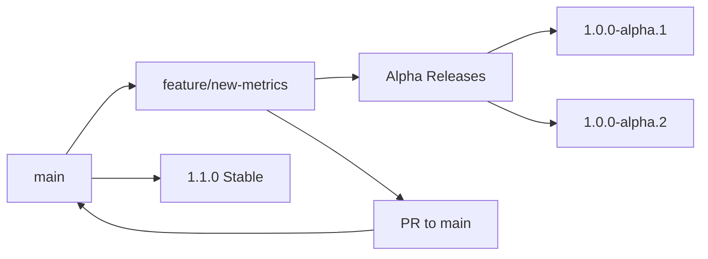
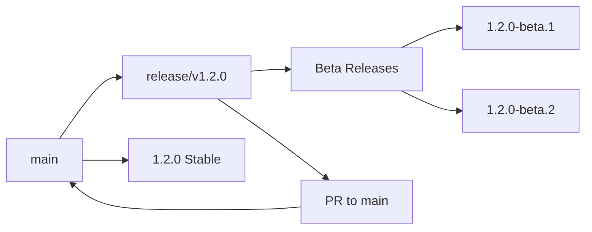
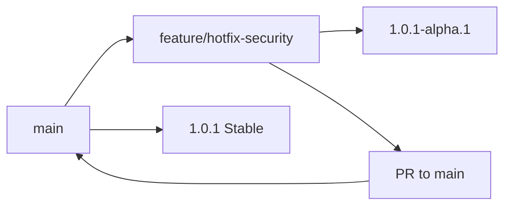

# Branching and Release Strategy

This document outlines the branching model and release strategy for the `@llevintza/fastify-prometheus-metrics` project. We follow a **trunk-based development** approach with automated semantic versioning.

## Overview

This project uses a simplified trunk-based development model with automated releases based on semantic commit messages. All development work flows through the `main` branch, with short-lived feature branches and release branches for stabilization.

## Branch Types and Release Mapping

| Branch Type | Purpose | Release Type | Example Version | Auto-Published | npm Tag |
|-------------|---------|--------------|-----------------|----------------|---------|
| `main` | Stable production code | **Stable** | `1.0.0`, `1.1.0`, `2.0.0` | ✅ | `latest` |
| `release/*` | Release preparation & stabilization | **Beta** | `1.0.0-beta.1`, `1.0.0-beta.2` | ✅ | `beta` |
| `feature/*` | Feature development & testing | **Alpha** | `1.0.0-alpha.1`, `0.1.0-alpha.3` | ✅ | `alpha` |

## Version Control System

### Automatic Version Bumping

Semantic-release automatically determines the version bump based on commit message types:

| Commit Type | Version Impact | Example | Result |
|-------------|----------------|---------|--------|
| `feat:` | **Minor** bump | `1.0.0` → `1.1.0` | New features |
| `fix:` | **Patch** bump | `1.0.0` → `1.0.1` | Bug fixes |
| `perf:` | **Minor/Patch** bump | `1.0.0` → `1.1.0` | Performance improvements |
| `BREAKING CHANGE:` | **Major** bump | `1.0.0` → `2.0.0` | Breaking changes |
| `feat!:` | **Major** bump | `1.0.0` → `2.0.0` | Breaking feature |
| `fix!:` | **Major** bump | `1.0.0` → `2.0.0` | Breaking fix |

### Manual Version Control

You can manually control version bumps using scopes:

| Scope | Version Impact | Example | Result |
|-------|----------------|---------|--------|
| `(major)` | **Major** bump | `feat(major): redesign API` | `1.0.0` → `2.0.0` |
| `(minor)` | **Minor** bump | `docs(minor): major documentation update` | `1.0.0` → `1.1.0` |
| `(patch)` | **Patch** bump | `chore(patch): update dependencies` | `1.0.0` → `1.0.1` |
| `(no-release)` | **No release** | `docs(no-release): fix typo` | No version change |

5. **Test the alpha release:**
   ```bash
   npm install @llevintza/fastify-prometheus-metrics@alpha
   ```

6. **Continue development:**
   ```bash
   # More commits will create alpha.10, alpha.11, etc.
   git commit -m "feat: improve error handling"
   git push
   ```

### 🧪 Creating Beta Releases (Release Candidates)

Beta releases are for final testing before production.

**Steps:**
1. **Switch to beta branch:**
   ```bash
   git checkout release/rc_1
   git pull origin release/rc_1
   ```

2. **Merge or cherry-pick features:**
   ```bash
   # Option A: Merge specific feature
   git merge feature/your-feature-name
   
   # Option B: Cherry-pick specific commits
   git cherry-pick <commit-hash>
   
   # Option C: Merge from main
   git merge main
   ```

3. **Push to trigger beta release:**
   ```bash
   git push origin release/rc_1
   ```

4. **Expected result:** Creates version like `1.0.0-beta.1`

5. **Test the beta release:**
   ```bash
   npm install @llevintza/fastify-prometheus-metrics@beta
   ```

6. **Fix issues and iterate:**
   ```bash
   git commit -m "fix: resolve beta testing issue"
   git push  # Creates beta.2, beta.3, etc.
   ```

### 🔧 Creating RC Releases (Release Candidate Preparation)

RC releases are for final validation before beta.

**Steps:**
1. **Switch to RC branch:**
   ```bash
   git checkout release/v0.0.1
   git pull origin release/v0.0.1
   ```

2. **Merge stable features:**
   ```bash
   git merge main
   # or merge specific features
   git merge feature/stable-feature
   ```

3. **Push to trigger RC release:**
   ```bash
   git push origin release/v0.0.1
   ```

4. **Expected result:** Creates version like `1.0.0-rc.1`

5. **Test the RC release:**
   ```bash
   npm install @llevintza/fastify-prometheus-metrics@rc
   ```

### 🌟 Creating Next Releases (Future Version Development)

Next releases are for major version development.

**Steps:**
1. **Switch to next branch:**
   ```bash
   git checkout next
   git pull origin next
   ```

2. **Merge breaking changes:**
   ```bash
   git merge feature/breaking-change
   ```

3. **Push to trigger next release:**
   ```bash
   git push origin next
   ```

4. **Expected result:** Creates version like `2.0.0-next.1`

5. **Test the next release:**
   ```bash
   npm install @llevintza/fastify-prometheus-metrics@next
   ```

### 📦 Creating Stable Releases (Production)

Stable releases are production-ready versions.

**Steps:**

#### Option 1: Release from Main Branch
```bash
git checkout main
git pull origin main
git merge release/rc_1  # or the branch you want to promote
git push origin main
```
**Result:** Creates version like `1.0.0`

#### Option 2: Release from Stable Branch
```bash
git checkout stable
git pull origin stable
git merge main
git push origin stable
```
**Result:** Creates version like `1.0.0` with `stable` channel

#### Option 3: Release from Latest Branch
```bash
git checkout latest
git pull origin latest
git merge main
git push origin latest
```
**Result:** Creates version like `1.0.0` with `latest` channel

### 🚨 Creating Hotfix Releases (Emergency Fixes)

Hotfix releases are for urgent production fixes.

**Steps:**
1. **Create hotfix branch from main:**
   ```bash
   git checkout main
   git pull origin main
   git checkout -b hotfix/security-fix
   ```

2. **Implement fix:**
   ```bash
   git commit -m "fix: resolve critical security vulnerability"
   ```

3. **Push to trigger hotfix release:**
   ```bash
   git push -u origin hotfix/security-fix
   ```

4. **Expected result:** Creates version like `1.0.0-hotfix.1`

5. **Test and promote to main:**
   ```bash
   # After testing
   git checkout main
   git merge hotfix/security-fix
   git push origin main  # Creates stable hotfix release
   ```

## Installation and Usage of Releases

### Installing Specific Release Types

```bash
# Latest stable release (recommended for production)
npm install @llevintza/fastify-prometheus-metrics

# Latest beta release (for testing upcoming features)
npm install @llevintza/fastify-prometheus-metrics@beta

# Latest alpha release (for testing cutting-edge features)
npm install @llevintza/fastify-prometheus-metrics@alpha

# Specific version
npm install @llevintza/fastify-prometheus-metrics@1.0.0-beta.2
npm install @llevintza/fastify-prometheus-metrics@1.2.0-alpha.5
```

### GitHub Packages Configuration

```bash
# Configure npm for GitHub Packages
echo "@llevintza:registry=https://npm.pkg.github.com" >> ~/.npmrc

# For authentication (if needed for private packages)
echo "//npm.pkg.github.com/:_authToken=YOUR_GITHUB_TOKEN" >> ~/.npmrc
```

### Usage Examples

```javascript
// Using stable release (production)
import fastifyPrometheus from '@llevintza/fastify-prometheus-metrics';

await fastify.register(fastifyPrometheus, {
  endpoint: '/metrics',
  enableDefaultMetrics: true
});

// Using beta release (staging/testing)
import fastifyPrometheus from '@llevintza/fastify-prometheus-metrics'; // @beta

// Testing new features not yet in stable
await fastify.register(fastifyPrometheus, {
  // New beta features available here
  experimentalFeatures: true
});

// Using alpha release (development/feature testing)
import fastifyPrometheus from '@llevintza/fastify-prometheus-metrics'; // @alpha

// Cutting-edge features for testing
await fastify.register(fastifyPrometheus, {
  // Latest alpha features (may be unstable)
  alphaFeatures: true
});
```

## Branch Naming Conventions

### Feature Branches
- **Format**: `feature/<description>`
- **Examples**: 
  - `feature/custom-metrics`
  - `feature/aws-integration`
  - `feature/hotfix-memory-leak`
  - `feature/performance-optimization`

### Release Branches
- **Format**: `release/v<major>.<minor>.<patch>`
- **Examples**:
  - `release/v1.0.0`
  - `release/v1.2.0`
  - `release/v2.0.0`
  - `release/v1.1.5`

## Automated Release Process

### CI/CD Pipeline Flow

1. **Code Quality Checks**: Linting, formatting, type checking
2. **Testing**: Unit tests across Node.js versions (20, 22)
3. **Build**: TypeScript compilation
4. **Version Analysis**: Semantic-release analyzes commits
5. **Version Bump**: Automatic version calculation
6. **Publishing**: Automatic publishing to GitHub Packages
7. **Documentation**: Automated changelog generation
8. **Notification**: GitHub release creation

### Release Artifacts

Each release includes:
- ✅ NPM package published to GitHub Packages
- ✅ GitHub release with generated changelog
- ✅ Git tags with semantic versions
- ✅ Updated `CHANGELOG.md` in repository
- ✅ Updated `package.json` version

## Best Practices

### For Contributors

1. **Use Conventional Commits**: Ensure proper automatic versioning
2. **Test Alpha Releases**: Use alpha versions to test your features
3. **Keep Features Small**: Prefer small, focused feature branches
4. **Include Documentation**: Update docs in the same PR as features
5. **Test Breaking Changes**: Use beta releases before stable deployment

### For Maintainers

1. **Review Beta Releases**: Thoroughly test beta versions before promoting
2. **Monitor Release Pipeline**: Ensure automated releases work correctly
3. **Maintain Changelog**: Review generated changelogs for accuracy
4. **Handle Hotfixes Quickly**: Use feature branches for urgent fixes
5. **Communicate Breaking Changes**: Provide clear migration guides

### For Users

1. **Use Stable Releases**: For production environments
2. **Test Beta Releases**: Help validate upcoming releases
3. **Provide Feedback**: Report issues with alpha/beta versions
4. **Check Changelogs**: Review changes before upgrading
5. **Pin Versions**: Use exact versions in production
echo "@llevintza:registry=https://npm.pkg.github.com" >> ~/.npmrc

# Or create .npmrc in your project
cat > .npmrc << EOF
@llevintza:registry=https://npm.pkg.github.com
//npm.pkg.github.com/:_authToken=\${NODE_AUTH_TOKEN}
EOF
```

## Release Workflow Examples

### Example 1: Feature Development to Production

```bash
# 1. Start feature development
git checkout -b feature/custom-histogram-buckets
git commit -m "feat: add configurable histogram buckets"
git push  # 📦 Creates 1.0.0-alpha.9

# 2. Test alpha version
npm install @llevintza/fastify-prometheus-metrics@alpha

# 3. Move to RC for broader testing
git checkout release/v0.0.1
git merge feature/custom-histogram-buckets
git push  # 📦 Creates 1.0.0-rc.1

# 4. Move to beta for final validation
git checkout release/rc_1
git merge release/v0.0.1
git push  # 📦 Creates 1.0.0-beta.1

# 5. Release to production
git checkout main
git merge release/rc_1
git push  # 📦 Creates 1.0.0
```

### Example 2: Hotfix Workflow

```bash
# 1. Create hotfix for critical issue
git checkout -b hotfix/memory-leak-fix
git commit -m "fix: resolve memory leak in metrics collection"
git push  # 📦 Creates 1.0.0-hotfix.1

# 2. Test hotfix version
npm install @llevintza/fastify-prometheus-metrics@hotfix

# 3. Deploy to production immediately
git checkout main
git merge hotfix/memory-leak-fix
git push  # 📦 Creates 1.0.1
```

### Example 3: Next Version Development

```bash
# 1. Start breaking changes for v2.0.0
git checkout next
git commit -m "feat!: redesign plugin API

BREAKING CHANGE: Configuration options have been restructured"
git push  # 📦 Creates 2.0.0-next.1

# 2. Continue development
git commit -m "feat: add new metrics types"
git push  # 📦 Creates 2.0.0-next.2

# 3. Eventually promote to main for 2.0.0 release
git checkout main
git merge next
git push  # 📦 Creates 2.0.0
```

## Commit Message Format

We use [Conventional Commits](https://www.conventionalcommits.org/) for automated versioning:

```
<type>[optional scope]: <description>

[optional body]

[optional footer(s)]
```

### Standard Commit Types

#### **Feature Addition (Minor Version)**
```bash
# Automatic minor bump
git commit -m "feat: add custom histogram buckets configuration"
# Result: 1.0.0 → 1.1.0

# With scope
git commit -m "feat(metrics): add prometheus push gateway support"
# Result: 1.0.0 → 1.1.0
```

#### **Bug Fix (Patch Version)**
```bash
# Automatic patch bump
git commit -m "fix: resolve memory leak in metrics collection"
# Result: 1.0.0 → 1.0.1

# With scope
git commit -m "fix(aws): correct CloudWatch metric dimensions"
# Result: 1.0.0 → 1.0.1
```

#### **Breaking Changes (Major Version)**
```bash
# Method 1: Using BREAKING CHANGE footer
git commit -m "feat: redesign plugin API for better performance

BREAKING CHANGE: The plugin configuration format has changed.
See migration guide for details."
# Result: 1.0.0 → 2.0.0

# Method 2: Using ! in type
git commit -m "feat!: remove deprecated metrics endpoints"
# Result: 1.0.0 → 2.0.0

git commit -m "fix!: change default histogram buckets"
# Result: 1.0.0 → 2.0.0
```

#### **Manual Version Control**
```bash
# Force major version bump
git commit -m "docs(major): complete API documentation rewrite"
# Result: 1.0.0 → 2.0.0

# Force minor version bump
git commit -m "chore(minor): update all dependencies"
# Result: 1.0.0 → 1.1.0

# Force patch version bump
git commit -m "style(patch): improve code formatting"
# Result: 1.0.0 → 1.0.1

# No release (development work)
git commit -m "test(no-release): add unit tests for edge cases"
# Result: No version change
```

#### **Other Commit Types**
```bash
# Performance improvements (minor bump)
git commit -m "perf: optimize metric collection performance"
# Result: 1.0.0 → 1.1.0

# Documentation (patch bump)
git commit -m "docs: update installation instructions"
# Result: 1.0.0 → 1.0.1

# Code refactoring (patch bump)
git commit -m "refactor: improve metrics export logic"
# Result: 1.0.0 → 1.0.1

# No release commits
git commit -m "chore: update build configuration"
git commit -m "test: improve test coverage"
git commit -m "ci: update GitHub Actions workflow"
# Result: No version change
```

## Workflow Examples

### 1. Feature Development Workflow



**Step-by-step:**
1. Create feature branch: `git checkout -b feature/new-metrics`
2. Develop with conventional commits
3. Each push creates alpha versions: `1.0.0-alpha.1`, `1.0.0-alpha.2`
4. Test alpha releases
5. Create PR to merge to `main`
6. Merge triggers stable release: `1.1.0`

### 2. Release Preparation Workflow



**Step-by-step:**
1. Create release branch: `git checkout -b release/v1.2.0`
2. Perform final testing and bug fixes
3. Each push creates beta versions: `1.2.0-beta.1`, `1.2.0-beta.2`
4. When ready, create PR to `main`
5. Merge triggers stable release: `1.2.0`

### 3. Hotfix Workflow



**Step-by-step:**
1. Create feature branch: `git checkout -b feature/hotfix-security`
2. Implement fix: `git commit -m "fix: resolve security vulnerability"`
3. Test with alpha release: `1.0.1-alpha.1`
4. Create expedited PR to `main`
5. Merge triggers hotfix release: `1.0.1`

## Installation and Usage of Releases

### Installing Specific Release Types

```bash
# Latest stable release
npm install @llevintza/fastify-prometheus-metrics

# Latest alpha release (for testing new features)
npm install @llevintza/fastify-prometheus-metrics@alpha

# Latest beta release (release candidates)
npm install @llevintza/fastify-prometheus-metrics@beta

# Latest RC release (release candidate preparation)
npm install @llevintza/fastify-prometheus-metrics@rc

# Latest next release (future major versions)
npm install @llevintza/fastify-prometheus-metrics@next

# Latest hotfix release (emergency fixes)
npm install @llevintza/fastify-prometheus-metrics@hotfix

# Specific version
npm install @llevintza/fastify-prometheus-metrics@1.0.0-beta.2
npm install @llevintza/fastify-prometheus-metrics@1.0.0-alpha.9
npm install @llevintza/fastify-prometheus-metrics@1.0.0-rc.1
```

### GitHub Packages Configuration

```bash
# Configure npm for GitHub Packages
echo "@llevintza:registry=https://npm.pkg.github.com" >> ~/.npmrc

# Or create .npmrc in your project
cat > .npmrc << EOF
@llevintza:registry=https://npm.pkg.github.com
//npm.pkg.github.com/:_authToken=\${NODE_AUTH_TOKEN}
EOF
```

## Release Workflow Examples

### Example 1: Feature Development to Production

```bash
# 1. Start feature development
git checkout -b feature/custom-histogram-buckets
git commit -m "feat: add configurable histogram buckets"
git push  # 📦 Creates 1.0.0-alpha.9

# 2. Test alpha version
npm install @llevintza/fastify-prometheus-metrics@alpha

# 3. Move to RC for broader testing
git checkout release/v0.0.1
git merge feature/custom-histogram-buckets
git push  # 📦 Creates 1.0.0-rc.1

# 4. Move to beta for final validation
git checkout release/rc_1
git merge release/v0.0.1
git push  # 📦 Creates 1.0.0-beta.1

# 5. Release to production
git checkout main
git merge release/rc_1
git push  # 📦 Creates 1.0.0
```

### Example 2: Hotfix Workflow

```bash
# 1. Create hotfix for critical issue
git checkout -b hotfix/memory-leak-fix
git commit -m "fix: resolve memory leak in metrics collection"
git push  # 📦 Creates 1.0.0-hotfix.1

# 2. Test hotfix version
npm install @llevintza/fastify-prometheus-metrics@hotfix

# 3. Deploy to production immediately
git checkout main
git merge hotfix/memory-leak-fix
git push  # 📦 Creates 1.0.1
```

### Example 3: Next Version Development

```bash
# 1. Start breaking changes for v2.0.0
git checkout next
git commit -m "feat!: redesign plugin API

BREAKING CHANGE: Configuration options have been restructured"
git push  # 📦 Creates 2.0.0-next.1

# 2. Continue development
git commit -m "feat: add new metrics types"
git push  # 📦 Creates 2.0.0-next.2

# 3. Eventually promote to main for 2.0.0 release
git checkout main
git merge next
git push  # 📦 Creates 2.0.0
```

## Branch Naming Conventions

### Feature Branches
- **Format**: `feature/<description>`
- **Examples**: 
  - `feature/custom-metrics`
  - `feature/aws-integration`
  - `feature/performance-improvements`

### Hotfix Branches
- **Format**: `hotfix/<description>`
- **Examples**:
  - `hotfix/memory-leak-fix`
  - `hotfix/security-vulnerability`
  - `hotfix/critical-bug-fix`

### Release Branches (Fixed Names)
- `release/rc_1` - Beta releases
- `release/v0.0.1` - RC releases
- `main` - Stable releases
- `stable` - Stable channel releases
- `latest` - Latest channel releases
- `next` - Next version releases

## Automated Release Process

### CI/CD Pipeline

1. **Code Quality Checks**: Linting, formatting, type checking
2. **Testing**: Unit tests across Node.js versions (20, 22)
3. **Build**: TypeScript compilation
4. **Release**: Semantic release with automated versioning
5. **Publishing**: Automatic publishing to GitHub Packages
6. **Documentation**: Automated changelog generation

### Release Artifacts

Each release includes:
- ✅ NPM package published to GitHub Packages
- ✅ GitHub release with generated changelog
- ✅ Git tags with semantic versions
- ✅ Updated `CHANGELOG.md` in repository

## Best Practices

### For Contributors

1. **Use Conventional Commits**: Ensure proper versioning
2. **Test Alpha Releases**: Use alpha versions to test features
3. **Keep Features Small**: Prefer small, focused feature branches
4. **Update Documentation**: Include docs in feature PRs

### For Maintainers

1. **Review Beta Releases**: Thoroughly test beta versions before promoting
2. **Monitor Release Pipeline**: Ensure automated releases work correctly
3. **Maintain Changelog**: Review generated changelogs for accuracy
4. **Handle Hotfixes Quickly**: Use feature branches for urgent fixes

### For Users

1. **Use Stable Releases**: For production environments
2. **Test Beta/RC Releases**: Help validate upcoming releases
3. **Try Alpha Releases**: Test new features early (non-production)
4. **Use Next Releases**: Preview major version changes
5. **Provide Feedback**: Report issues with pre-release versions
6. **Check Changelogs**: Review changes before upgrading

## Quick Reference

### Branch to Release Type Mapping
```bash
# Alpha releases (feature development)
feature/my-feature        → 1.0.0-alpha.X

# RC releases (release candidate preparation)  
release/v0.0.1           → 1.0.0-rc.X

# Beta releases (final testing)
release/rc_1             → 1.0.0-beta.X

# Next releases (major version development)
next                     → 2.0.0-next.X

# Hotfix releases (emergency fixes)
hotfix/urgent-fix        → 1.0.0-hotfix.X

# Stable releases (production)
main                     → 1.0.0
stable                   → 1.0.0 (stable channel)
latest                   → 1.0.0 (latest channel)
```

### Installation Commands
```bash
npm install @llevintza/fastify-prometheus-metrics         # stable
npm install @llevintza/fastify-prometheus-metrics@alpha   # alpha
npm install @llevintza/fastify-prometheus-metrics@rc      # rc
npm install @llevintza/fastify-prometheus-metrics@beta    # beta
npm install @llevintza/fastify-prometheus-metrics@next    # next
npm install @llevintza/fastify-prometheus-metrics@hotfix  # hotfix
```

## Troubleshooting

### Common Issues

**Release Not Triggered**
- Verify commit message follows conventional format
- Check branch name matches expected patterns
- Ensure CI pipeline passes all checks

**Version Not as Expected**
- Review commit message types and their version impact
- Check for `BREAKING CHANGE:` in commit footer
- Verify branch configuration in `.releaserc.js`

**Package Not Found**
- Ensure GitHub Packages registry is configured
- Check authentication with GitHub Packages
- Verify package scope and name

## Migration Guide

When upgrading between major versions, see the [CHANGELOG.md](../CHANGELOG.md) for detailed migration instructions and breaking changes.

---

For questions about the release process, please check the [Contributing Guide](../CONTRIBUTING.md) or open an issue.
